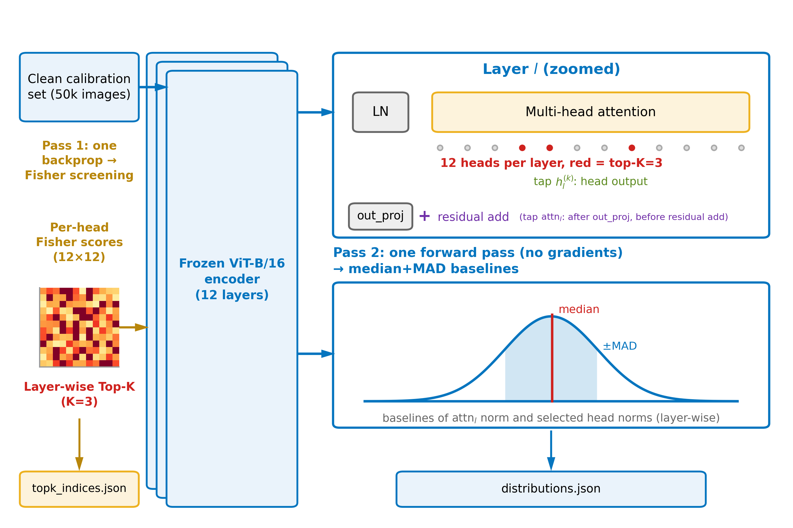
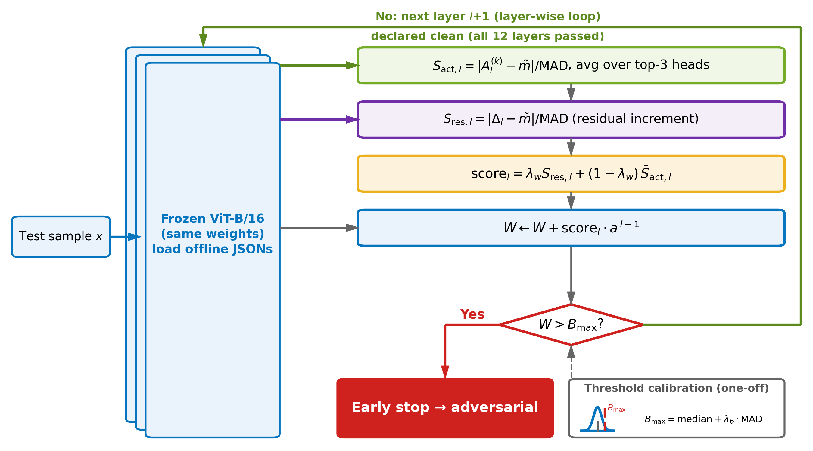

# DReaM: Dual-Distribution Residual-stream Monitoring

Training-free adversarial detection framework for Vision Transformers.

## Overview

DReaM is a **training-free** adversarial detection framework for Vision Transformers (ViTs). It requires only a single offline analysis after model training:

1. **Pass 1 — Fisher head screening**: selects the most loss-sensitive attention heads per layer using a Fisher-information-inspired importance score (one backward pass over the calibration set);
2. **Pass 2 — Dual-distribution baselines**: builds robust median + MAD baselines for both head-output activation magnitudes and attention residual increments (one gradient-free forward pass);
3. **Online detection**: accumulates depth-weighted layer-wise anomaly scores into a global score and declares a sample adversarial once the score crosses a calibrated threshold (monotonic early stopping).

No adversarial samples, no retraining, and no architectural modification are needed at any stage.





## Requirements

- Python >= 3.9
- PyTorch >= 2.0
- torchvision
- numpy, scipy, scikit-learn, tqdm, PyYAML, matplotlib
- NVIDIA GPU with CUDA (recommended)

## Setup

```bash
# 1. Enter project directory
cd project

# 2. Create environment (optional but recommended)
conda create -n dream python=3.10
conda activate dream

# 3. Install dependencies
pip install -r requirements.txt
# or manually:
# pip install torch torchvision numpy scipy scikit-learn tqdm pyyaml matplotlib
```

## Data Preparation

All datasets are placed under the `data/` folder in the project root.

**CIFAR-10** — `torchvision` auto-downloads on first run:

```
data/cifar10/
└── cifar-10-batches-py/
```

**CIFAR-100** — auto-download if network permits, or download
`cifar-100-python.tar.gz` manually and place it under `data/cifar100/`:

```
data/cifar100/
└── cifar-100-batches-py/
    ├── meta
    ├── test
    └── train
```

**ISIC 2018** (Task 3, 7-class skin lesion classification) — requires manual
registration and download from the
[official challenge site](https://challenge.isic-archive.com/data/#2018).
Place the downloaded zip files (`ISIC2018_Task3_{Training,Validation,Test}_{Input,GroundTruth}.zip`)
under `data/isic2018_raw/`, then run:

```bash
python scripts/prepare_isic2018.py   # extracts zips and builds the split structure
```

The script produces the layout expected by `src/data/isic_loader.py`
(official split: 10,015 train / 193 val / 1,512 test images):

```
data/isic2018/
├── train/
│   ├── images/        # ISIC_xxxxxxx.jpg
│   └── labels.csv     # columns: image,label
├── val/
│   ├── images/
│   └── labels.csv
└── test/
    ├── images/
    └── labels.csv
```

## Step 0: Train the Classification Head (Required Once per Dataset)

The ViT-B/16 backbone (`vit_b_16-c867db91.pth`, downloadable from the
[official torchvision link](https://download.pytorch.org/models/vit_b_16-c867db91.pth)
or auto-downloaded on first run) ships with the ImageNet 1000-class head.
For each downstream dataset, a dataset-specific linear head must be trained
**once** before running any experiment — adversarial attacks are only
meaningful against a properly trained classifier. The detector itself
(DReaM) stays training-free; only the victim classifier's head is fit via
linear probing on the frozen backbone.

```bash
# Trains a linear head on frozen ImageNet features (AdamW, lr=1e-3, 10 epochs)
# Saves to weights/vit_b_16_{dataset}.pth
python src/models/train_head.py --config configs/cifar10.yaml    # -> vit_b_16_cifar10.pth  (94.25% clean acc)
python src/models/train_head.py --config configs/cifar100.yaml   # -> vit_b_16_cifar100.pth
python src/models/train_head.py --config configs/isic2018.yaml   # -> vit_b_16_isic2018.pth
```

Each dataset's config already points to its own head checkpoint via
`weights_path`, so no manual path editing is needed afterwards.
Pre-trained heads are also available under
[Releases](https://github.com/tingfeng12317/DReaM/releases).

> Verify success: the script prints `[After] Test Accuracy` at the end
> (expected ~94% for CIFAR-10).

## Quick Start (One-Click Pipeline)

Run all core experiments in one command. The script automatically skips
completed steps and resumes from interruption.

```bash
# CIFAR-10 (Main Benchmark)
python scripts/main.py --config configs/cifar10.yaml

# CIFAR-100 (Cross-dataset Validation)
python scripts/main.py --config configs/cifar100.yaml

# ISIC 2018 (Medical Imaging, 7-class)
python scripts/main.py --config configs/isic2018.yaml
```

**Options:**

```bash
# Force re-run all steps (overwrite existing outputs)
python scripts/main.py --config configs/cifar10.yaml --force

# Run only a specific step (for debugging)
python scripts/main.py --config configs/cifar10.yaml --step profiler
python scripts/main.py --config configs/cifar10.yaml --step distribution
python scripts/main.py --config configs/cifar10.yaml --step generate_adv
python scripts/main.py --config configs/cifar10.yaml --step tune_params
python scripts/main.py --config configs/cifar10.yaml --step evaluate_test
```

**Skip the offline passes (optional).** Pre-computed screening indices and
median+MAD baselines are provided in `assets/baselines/`. To run online
detection directly, copy them into the output paths expected by the code:

```bash
mkdir -p outputs/cifar10/topk_indices outputs/cifar10/distributions
cp assets/baselines/k3.json outputs/cifar10/topk_indices/
cp assets/baselines/k3_distributions.json outputs/cifar10/distributions/
python scripts/main.py --config configs/cifar10.yaml
```

## Step-by-Step Execution (Advanced / Debugging)

If you prefer to run each step manually or need to debug a specific stage:

```bash
# Step 1: Profile attention heads (Fisher-based screening)
python src/dream/profiler.py --config configs/cifar10.yaml

# Step 2: Build distribution baselines (median + MAD)
python src/dream/distribution.py --config configs/cifar10.yaml

# Step 3: Generate adversarial samples (FGSM + PGD-20)
python src/attacks/generate_adv.py --config configs/cifar10.yaml

# Step 4: Hyperparameter tuning (3 stages: a -> lambda_b -> lambda_w)
python src/evaluation/tune_params.py --config configs/cifar10.yaml

# Step 5: Final test evaluation (locked parameters)
python src/evaluation/evaluate_test.py --config configs/cifar10.yaml

# Step 6: Ablation studies (optional, for paper figures)
python src/evaluation/ablation.py --config configs/cifar10.yaml

# Step 7: Extract tuning results to CSV (optional)
python scripts/extract_tuning.py --config configs/cifar10.yaml

# Step 8: Generate paper figures (5 PNGs)
python scripts/plot_results.py --config configs/cifar10.yaml
```

## Baseline Detectors

Four training-free baselines covering feature-space and logit-space
statistics (currently configured for CIFAR-10):

```bash
python src/baselines/mahalanobis/maha_detector.py      # Mahalanobis distance (feature space)
python src/baselines/react/react_detector.py           # ReAct (clipped activations)
python src/baselines/msp_energy/msp_energy_detector.py # MSP + Energy (logit space)
```

## Ablation Studies (Table 6 of the Paper)

Head-screening ablations use dedicated configs (monitored heads per layer,
and Fisher-guided vs. random selection). **Order matters**: run the K=12
config first (it produces `k12.json`), then `prep_ablation.py`, which
validates the top-3 prefix against `k3.json`, slices K=1/K=6 head sets from
`k12.json`, and generates three random head selections:

```bash
python scripts/main.py --config configs/cifar10_k12.yaml       # full-network monitoring (K=12), run first
python scripts/prep_ablation.py                                # build k1/k6/random head sets from k12.json
python scripts/main.py --config configs/cifar10_k1.yaml        # K=1 head per layer
python scripts/main.py --config configs/cifar10_k6.yaml        # K=6 heads per layer
python scripts/main.py --config configs/cifar10_random_s0.yaml # random heads, seed 0
python scripts/main.py --config configs/cifar10_random_s1.yaml # random heads, seed 1
python scripts/main.py --config configs/cifar10_random_s2.yaml # random heads, seed 2
```

## Main Results (ViT-B/16, CIFAR-10 Test Set)

Victim model: frozen ImageNet-pretrained ViT-B/16 + linear head
(94.25% clean accuracy). Attack success rate: FGSM 78.71%, PGD-20 100%.

| Method | FGSM AUROC | PGD-20 AUROC | FGSM FPR@95TPR | PGD-20 FPR@95TPR |
|:---|:---:|:---:|:---:|:---:|
| Mahalanobis | 0.790 | 0.710 | 0.4853 | 0.6334 |
| ReAct | 0.701 | 0.740 | 0.8289 | 0.9111 |
| MSP | 0.861 | **0.090** | 0.5009 | 1.0000 |
| Energy | 0.894 | **0.068** | 0.4363 | 1.0000 |
| **DReaM** | **0.9933** | **0.9958** | **0.0169** | **0.0159** |

DReaM detection rate (TPR at calibrated threshold): FGSM 100%, PGD-20 99.69%.
Logit-space baselines collapse below random guessing under PGD-20 because
iterative optimization drives the model toward highly confident wrong
predictions (mean MSP rises 0.887 -> 0.987); see Section 7.3 of the paper.

Cross-dataset results (same hyperparameters a=1.0, lambda_w=0.3;
lambda_b=4.0 for CIFAR, 3.5 for ISIC):

| Dataset | FGSM AUROC | PGD-20 AUROC | FGSM TPR | PGD-20 TPR |
|:---|:---:|:---:|:---:|:---:|
| CIFAR-100 | 0.9861 | 0.9877 | 0.9809 | 0.9650 |
| ISIC 2018 | 0.9545 | 0.9839 | 0.8671 | 0.9815 |

## Project Structure

```
project/
├── configs/              # Dataset configurations
│   ├── cifar10.yaml
│   ├── cifar100.yaml
│   ├── isic2018.yaml
│   └── cifar10_{k1,k6,k12,random_s0,random_s1,random_s2}.yaml   # ablations
├── src/
│   ├── data/             # Dataset loaders and registry
│   ├── models/           # ViT wrapper + gradient hooks + train_head.py
│   ├── dream/            # Profiler, distribution builder, detector
│   ├── attacks/          # PGD/FGSM attack implementations
│   ├── baselines/        # Mahalanobis, ReAct, MSP/Energy detectors
│   ├── evaluation/       # Metrics, tuning, test evaluation, ablation
│   └── utils/            # Config loader and pipeline utilities
├── scripts/
│   ├── main.py           # One-click pipeline (recommended)
│   ├── eval_clean_acc.py # Clean accuracy of the linear-probe model
│   ├── prep_ablation.py  # Prepare ablation runs
│   ├── extract_tuning.py # Extract grid search results to CSV
│   ├── plot_results.py   # Generate paper figures (5 PNGs)
│   └── prepare_isic2018.py # ISIC 2018 download/split helper
├── assets/
│   ├── fig_framework_*.png   # framework figures shown above
│   └── baselines/            # pre-computed top-K indices and median+MAD baselines
├── outputs/              # Auto-generated per dataset (git-ignored)
│   └── {dataset}/
│       ├── topk_indices/
│       ├── distributions/
│       ├── metrics/
│       ├── grid_search/
│       ├── ablation/
│       └── figures/
├── data/                 # Datasets + adversarial samples (git-ignored)
│   ├── cifar10/
│   ├── cifar100/
│   ├── isic2018/
│   └── adversarial/
├── weights/              # Backbone + per-dataset trained heads (git-ignored)
│   ├── vit_b_16-c867db91.pth      # ImageNet backbone (source)
│   ├── vit_b_16_cifar10.pth       # CIFAR-10 head (94.25% clean acc)
│   ├── vit_b_16_cifar100.pth      # CIFAR-100 head
│   └── vit_b_16_isic2018.pth      # ISIC 2018 head
├── requirements.txt
└── LICENSE
```

## Evaluation Protocol

- The **training split** serves as the validation set for offline baseline
  construction and hyperparameter tuning (no adversarial samples are used
  during calibration).
- The **test split** is touched only once, for the final locked-parameter
  evaluation (`evaluate_test`).
- All baselines are evaluated under the identical setting on the same frozen
  backbone.

## Output Organization

All intermediate and final outputs are organized under `outputs/{dataset_name}/`
to avoid overwriting across datasets:

| File | Path |
|:---|:---|
| Top-K indices | `outputs/{dataset}/topk_indices/k3.json` |
| Distribution baselines | `outputs/{dataset}/distributions/k3_distributions.json` |
| Tuning results | `outputs/{dataset}/grid_search/staged_tuning_results.json` |
| Ablation results | `outputs/{dataset}/ablation/ablation_results.json` |
| Test metrics | `outputs/{dataset}/metrics/test_final_tuned_report.json` |
| Figures | `outputs/{dataset}/figures/` |
| Adversarial samples | `data/adversarial/{attack}_{dataset}_{split}/adv_data.pkl` |

## Adding a New Dataset

1. Create a new config file: `configs/newdataset.yaml` (copy from `configs/cifar10.yaml`)
2. Update dataset-specific fields: `name`, `num_classes`, `batch_size`, etc.
3. If the dataset is not supported by `torchvision`, implement a custom loader
   in `src/data/custom_loaders.py` and register it in `src/data/dataset_registry.py`.
4. Train the classification head:
   ```bash
   python src/models/train_head.py --config configs/newdataset.yaml
   ```
5. Run the pipeline:
   ```bash
   python scripts/main.py --config configs/newdataset.yaml
   ```

## Acknowledgements

- The Mahalanobis baseline in `src/baselines/mahalanobis/` is adapted from the
  [official implementation](https://github.com/pokaxpoka/deep_Mahalanobis_detector)
  of Lee et al., *A Simple Unified Framework for Detecting Out-of-Distribution
  Samples and Adversarial Attacks* (NeurIPS 2018).
- The ViT-B/16 backbone uses ImageNet-1K pretrained weights provided by
  [torchvision](https://pytorch.org/vision/stable/models.html).

## Citation

If you find this work useful, please cite:

```bibtex
@article{dream2026,
  title   = {DReaM: Dual-Distribution Residual-stream Monitoring for Training-Free Adversarial Detection in Vision Transformers},
  author  = {Sun, Haijing and Jin, Shuyu and Shao, Yichuan and Zhang, Zhitao},
  journal = {Pattern Recognition (submitted)},
  year    = {2026}
}
```

## License

This project is released under the [MIT License](LICENSE).
